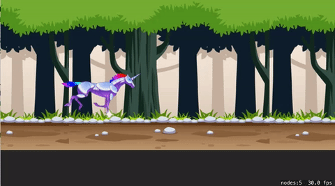

# SpriteAtlas

This example shows some ways that you might use SKAction to create intersting animation effects. The example borrows
the sprite sheet from Robot Unicorn Attack, a great game you should try it. 

Tapping the left side of the screen makes hte unicorn leap. Tapping the right side of the screen makes the unicorn dash. 

See the comments for more information. 

## Run

## Jump

## Dash 

